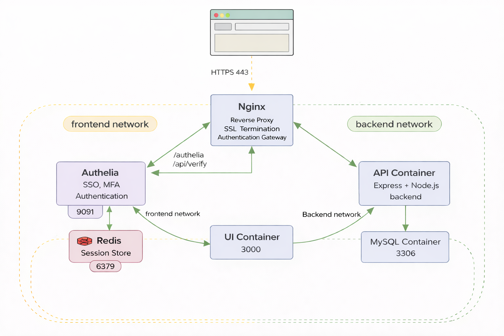

# Full Stack JS App — Containerized Architecture

## Overview

Full-stack JavaScript application containerized with Podman / Docker Compose.

Stack:
- React (Frontend)
- Node.js + Express (API)
- MySQL (Database)
- Nginx (Reverse Proxy)

---

## Architecture

### Containers

| Service  | Role | Port | Network |
|-----------|------|------|----------|
| Nginx | Reverse proxy / entry point | 80 | frontend + backend |
| Blog UI | React frontend | 3000 (internal) | frontend |
| API | Backend REST service | 5050 (internal) | backend |
| MySQL | Database | 3306 (internal) | backend |

---

## Networks

- **frontend** → Nginx + UI  
- **backend** → Nginx + API + MySQL  

Network isolation prevents direct access to the database.

---