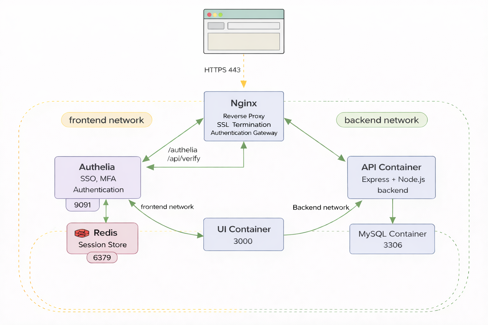

# Full Stack JS App — Secure Containerized Architecture (2 VMs)

## Overview
This project is a secure full-stack web application running in containers, protected by a reverse proxy and centralized authentication (SSO/MFA).  
It is deployed on two virtual machines:

- **VM1 (App Stack):** runs the application containers + monitoring agents
- **VM2 (Monitoring Stack):** runs the observability platform (metrics + logs + dashboards)
---

## Technology Stack

### Application Stack
- **React** — Frontend UI
- **Node.js / Express** — Backend API
- **MySQL** — Database
- **Nginx** — Reverse Proxy & TLS termination
- **Authelia** — Authentication gateway (SSO / MFA)
- **Redis** — Session store for Authelia

### Observability Stack
- **Prometheus** — Metrics collection
- **Grafana** — Dashboards & visualization
- **Loki** — Centralized log storage
- **Promtail** — Log shipping agent
- **Node Exporter** — System metrics
- **cAdvisor** — Container metrics

### Containerization
- **Docker**
- **Docker Compose**
---

## Infrastructure Topology

The platform is deployed across two virtual machines to separate the application workload from the observability stack.

### VM1 — Application Stack
This VM hosts the business application and the monitoring agents.

Services running on VM1:

- Nginx (Reverse proxy)
- Authelia (Authentication gateway)
- Redis (Session store)
- UI (React frontend)
- API (Node.js backend)
- MySQL database
- Node Exporter (system metrics)
- cAdvisor (container metrics)
- Promtail (log collector)

### VM2 — Monitoring Stack
This VM centralizes metrics, logs, and dashboards.

Services running on VM2:

- Prometheus (metrics collection)
- Loki (log storage)
- Grafana (visualization platform)

---
## Architecture

### Application Architecture


### Observability Architecture


---
## Deployment

The platform is deployed across two virtual machines.

- **VM1** runs the application stack
- **VM2** runs the monitoring stack

Both stacks are managed using **Docker Compose**.

---

### 1. Clone the repository

```bash
git clone https://github.com/ismail-bouaziz/full-stack-js-app.git
cd full-stack-js-app

```
---

### 2. Create the environment variables

```bash
cd app
nano .env
```

Add the following variables:

```bash
MYSQL_DATABASE=blog
MYSQL_USER=mysql
MYSQL_PASSWORD=mysql
MYSQL_ROOT_PASSWORD=root
MYSQL_HOST=db
API_PORT=5050
CLIENT_PORT=3000
```

Save and exit.

---

### 3. Start the Application Stack (VM1)

From the app-stack directory run:

```bash
docker compose up -d
```

- This will start the following services:
- Nginx – reverse proxy and SSL termination
- Authelia – authentication and access control
- Redis – session store
- UI – React frontend
- API – Node.js backend
- MySQL – application database
- Node Exporter – host metrics
- cAdvisor – container metrics
- Promtail – log collector

---
### 4. Start the Monitoring Stack (VM2)

Navigate to the monitoring stack directory:

```bash
cd monitoring-stack
```

```bash
docker compose up -d
```

This will start:

- Prometheus
- Loki
- Grafana